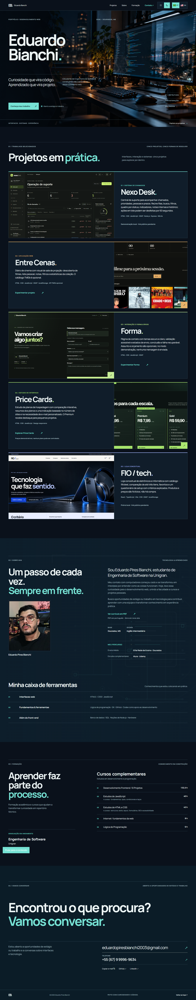

# Eduardo Bianchi · Portfólio

Portfólio pessoal de **Eduardo Pires Bianchi**, estudante de Engenharia de Software em Dourados, MS. Reúne projetos de interfaces, uma aplicação de suporte e experiências interativas.



## Conteúdo

- Página responsiva em português e inglês, com temas claro e escuro.
- Animações GSAP com suporte à preferência por movimento reduzido.
- **Nexo Desk**, **Entre Cenas**, **Forma**, **Price Cards** e **FIO / tech** apresentados em uma galeria de painéis equivalentes, com capturas reais das interfaces.
- Demonstrações locais de **Entre Cenas**, **Forma** e **Price Cards**.
- Currículo em PDF disponível na seção Sobre.

## Projetos

| Projeto | Sobre | Tecnologias |
| --- | --- | --- |
| **Nexo Desk** | Sistema local de suporte com fila e quadro de chamados, filtros, indicadores, histórico, notas internas e ações em lote com opção de desfazer. O portfólio mostra capturas; não inclui a API nem o banco do sistema. | HTML, CSS, JavaScript, GSAP, Node.js, Express, SQLite |
| **Entre Cenas** | Diário de cinema para descobrir filmes, organizar uma lista pessoal e registrar avaliações e anotações. O catálogo TMDb é opcional e pede um token no navegador; a coleção de demonstração funciona sem ele. | HTML, CSS, JavaScript, GSAP, localStorage, TMDb opcional |
| **Forma** | Página de contato com temas claro e escuro, validação acessível, assunto e orçamento opcionais. A demonstração não envia mensagens; o envio real depende de um serviço configurado. | HTML, CSS, JavaScript, GSAP |
| **Price Cards** | Estudo responsivo de planos de hospedagem com comparação interativa, resumos e indicação por quantidade de sites e necessidade de e-mail personalizado. Preços apenas demonstrativos. | HTML, CSS, JavaScript |
| **FIO / tech** | Loja conceitual de eletrônicos e informática com catálogo, filtros, comparação de até três itens, favoritos e questionário de setup baseado em regras explicadas. Produtos e preços fictícios; sem compra real. | React, TypeScript, Vite, CSS, GSAP, localStorage |

As demonstrações de Entre Cenas, Forma e Price Cards estão incluídas em `projetos/` e podem ser abertas pelo portfólio. Cada uma funciona sem instalar dependências. Nexo Desk e FIO / tech são apresentados com capturas reais; suas aplicações não fazem parte deste repositório. Os links públicos podem ser preenchidos em `script.js` quando estiverem disponíveis.

## Executar localmente

O site é estático e não precisa de compilação nem instalação de pacotes. Na pasta do repositório, inicie um servidor HTTP local:

```bash
python -m http.server 8080
```

No Windows, também é possível usar `py -3 -m http.server 8080`. Acesse `http://localhost:8080` no navegador. Para conferir uma demonstração diretamente, abra `projetos/entre-cenas/`, `projetos/forma/` ou `projetos/price-cards/`.

## Estrutura

- `index.html`, `style.css`, `script.js`, `language.js`: página, estilos, interações e traduções.
- `assets/`: capturas reais, artes originais, fontes com suas licenças e currículo público.
- `assets/vendor/`: cópias locais do GSAP e ScrollTrigger com avisos de licença preservados.
- `projetos/`: demonstrações autocontidas dos projetos incluídos.
- `tools/build_resume.py`: código-fonte do currículo PDF. Requer Python, ReportLab e fontes Arial disponíveis no ambiente Windows usado para gerá-lo.
- `DESIGN.md`: notas sobre a direção visual do portfólio.

## Informações públicas

O portfólio exibe nome, cidade, e-mail, LinkedIn e telefone para contato profissional. O PDF público mantém os dados que já constam nele. A configuração de envio do Forma está vazia por padrão: nenhum formulário envia dados até que um serviço seja configurado pelo responsável pelo deploy. Entre Cenas solicita o token TMDb ao visitante e o guarda apenas na sessão do navegador.

O README, o código e os recursos deste repositório não precisam de arquivos `.env`, tokens, banco de dados local ou credenciais. Não adicione esses dados ao publicar. A pasta `tmp/` é local e fica ignorada pelo Git.

## Licenças

Os arquivos de fonte e as cópias do GSAP incluem seus avisos de licença. Este repositório não define uma licença geral de reutilização para o portfólio, currículo, imagens e código. Peça autorização ao autor antes de reutilizar esses materiais.
